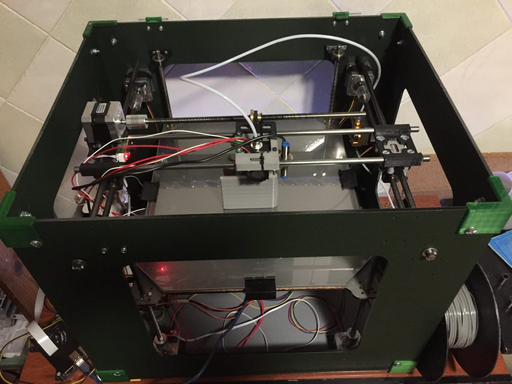

# Krotos3D

Custom [Marlin](https://github.com/MarlinFirmware/Marlin) firmware for [Krotos3d](https://kustomizit.com/build-your-own-3d-printer/) printer



## New Gcode
```
M777 - HW bed leveling
```
New custom gcode to use the 4-motor Z axis

## Remarkable settings
```
G28 - Auto Home
G29 - Bed Leveling
M80 - Power On
M81 - Power Off
M114 - Get Current Position
M420 - Bed Leveling State
M500 - Save Settings
M503 - Report Settings
M851 - XYZ Probe Offset
```

## Tips
```
M420 S1 - before printing enables bed leveling
M851 Z-X.XX - sets nozzle diff
```
